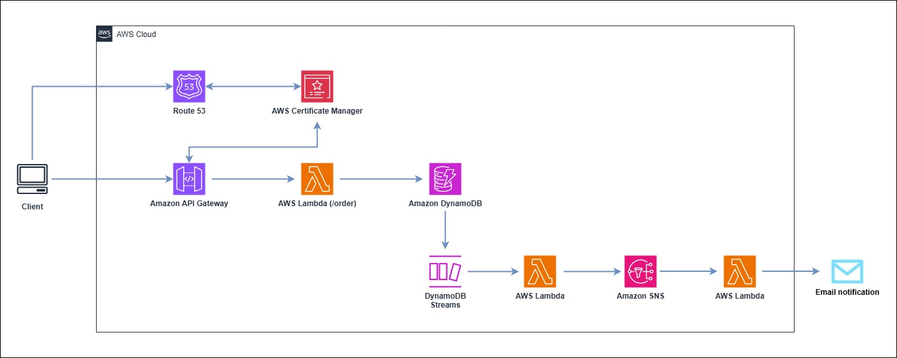

# CDK practice

## References

1. https://docs.aws.amazon.com/whitepapers/latest/serverless-multi-tier-architectures-api-gateway-lambda/web-application.html
2. https://docs.aws.amazon.com/amazondynamodb/latest/developerguide/Streams.Lambda.html

## Environment

- AWS CDK v2.162.0
- Typescript v5.6.3

## Architecture

