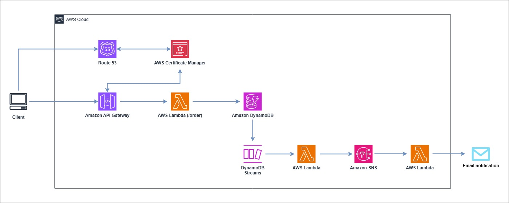

# Multi-tier architecture with Lambda

## Reference

1. https://docs.aws.amazon.com/whitepapers/latest/serverless-multi-tier-architectures-api-gateway-lambda/web-application.html
2. https://docs.aws.amazon.com/amazondynamodb/latest/developerguide/Streams.Lambda.html

## Environment

- go v1.23.0
- cdk v2.158.0

## Architecture

